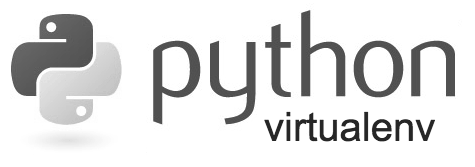

# Lisbon Data Science Academy 

This repository contains all the information to set up the necessary environments for LDSA courses

## Lisbon Data Science Starters Academy

### Initial Setup

Please choose your operating system (OS):

<table>
  <tr>
    <td>
      
    </td>
    <td>
      
    </td>
    <td>
      
    </td>
  </tr>
</table>

 

### Setup for all Operating Systems

<table>
  <tr>
    <td>
        
    </td>
  </tr>
</table>   

### Setup _Git_ and _GitHub_

<table>
  <tr>
    <td>
        
    </td>
  </tr>
</table>  

### LDSSA Learning Units

### Troubleshooting

## Prep Course

:warning: Under Construction :warning: