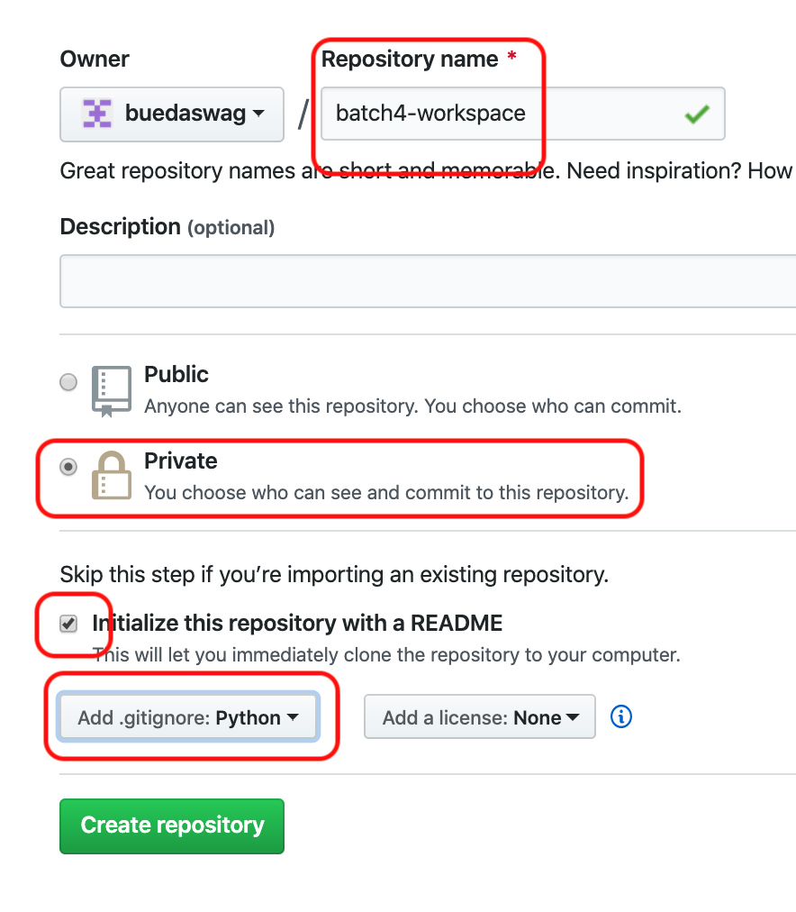
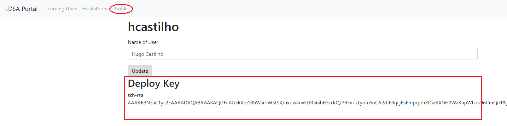
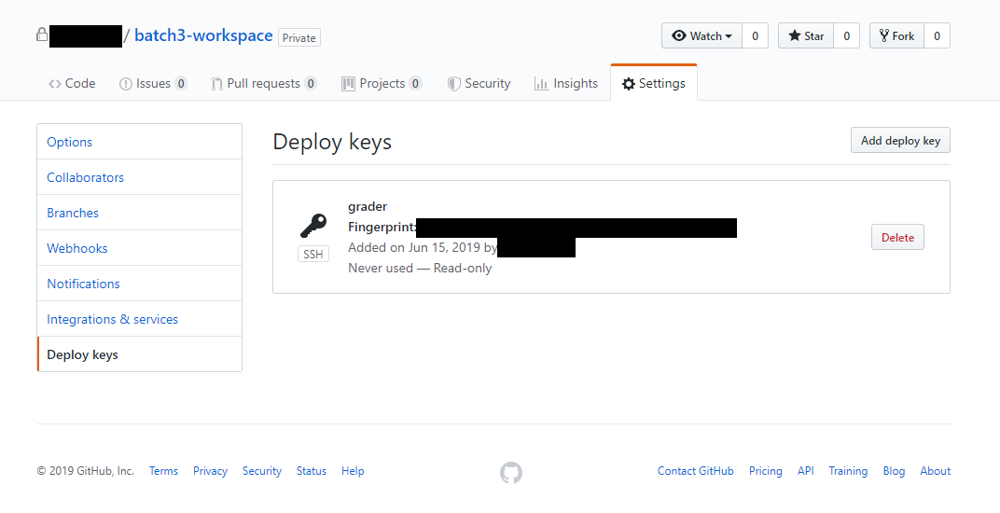

# Setup _Git_ and _GitHub_

Having a _GitHub_ account and knowing the basics of committing and pushing changes are **mandatory** for this academy.

:warning:**If you don't have a _GitHub_ account, complete the following steps:**

1. [Sign up](https://github.com/join) for a _GitHub_ account if you don't
already have one.

:warning:**If you have a _GitHub_ account but git is not set up in your system, complete the following steps:**

1. [Checking for existing SSH keys](https://help.github.com/en/github/authenticating-to-github/checking-for-existing-ssh-keys)
1. [Generating a new SSH key and adding it to the ssh-agent](https://help.github.com/en/github/authenticating-to-github/generating-a-new-ssh-key-and-adding-it-to-the-ssh-agent)
1. [Adding a new SSH key to your GitHub account](https://help.github.com/en/github/authenticating-to-github/adding-a-new-ssh-key-to-your-github-account)
1. [Testing your SSH connection](https://help.github.com/en/github/authenticating-to-github/testing-your-ssh-connection)

### Setup your Workspace Repository

The workspace directory/repository is where you will place everything you are working on, solve exercises, make changes to files, etc.
In this academy that **is a requirement** as it is how you will make your work available to us.

#### Creating the Workspace

1. Log into _GitHub_
1. Create a new **private** _GitHub_ repository called *batch6-workspace*, see
[Creating a new repository](https://help.github.com/en/articles/creating-a-new-repository).
**IMPORTANT** The repo **MUST** be named *batchX-workspace* where *X* is the current batch number! 
If you name it anything else, you will be unable to submit any of your work!
    1. You need to explicitly select **Private** - This is your work and nobody else's.
    You will be graded based upon the merits of what you are able to do here
    so this should not be open to the world while you are working
    on it.
    1. Initialize with a README.
    This is mostly just so that you don't initialize an empty repo.
    1. Add a Python `.gitignore`.
    This step is insanely important. If you don't do this, you may
    end up checking things into the repo that make it un-gradeable by our
    grading system.
    ADD THE `.gitignore` PLEASE!!!! <--- 4 * `!` isn't enough



#### Add a Deploy Key to your Repository

Since the repository is private you will have to explicitly give access so
that our grading system can fetch the repository.
To do this you will be adding a deploy key to the repository, which we
provide to you in our [_Portal_](https://portal.lisbondatascience.org/).

1. Head on to the [_Portal_](https://portal.lisbondatascience.org/)
1. Log in with your _GitHub_ account
1. Go to your [profile](https://portal.lisbondatascience.org/users/info/) and
copy the deploy key (including the `ssh-rsa` part)

1. Go back to the repository you have just created
1. Go to `Settings > Deploy Keys`
1. Click "Add deploy key" (no need to grant Write Access)
1. Give it a recognizable name like "grader" and paste the key from the
_Portal_


#### Cloning the Workspace

1. Open a Terminal or Git Bash, the next steps are on this terminal
1. Clone your `<username>/batchX-workspace` repository

    > If you're not sure where to clone the repository in, you can create a `~/projects` folder, and clone it there.
    > Don't forget to replace the `X` with your corresponding batch number. For example, for batch 6, your repository should be `batch6-workspace`. 

1. Clone the students repository
If you have your [**ssh keys set up**](#Setup-Git-and-GitHub) as instructed:

```bash
git clone git@github.com:<username>/batchX-workspace.git
```

else

```bash
git clone https://github.com/<username>/batchX-workspace.git
```

### Get the Learning Material

You will be cloning the [batchX-students](https://github.com/LDSSA/)
repository.

> for batch6 this will be `https://github.com/LDSSA/batch6-students`

All of the learning material you need will be made available on this repo
as the academy progresses.

1. Open a Terminal or Git Bash, the next steps are on this terminal
1. Clone the students repository
[batch6-students](https://github.com/LDSSA/batch6-students)

```bash
git clone https://github.com/LDSSA/batch6-students.git
```

Or if you have your ssh keys set up:

```bash
git clone git@github.com:LDSSA/batch6-students.git
```